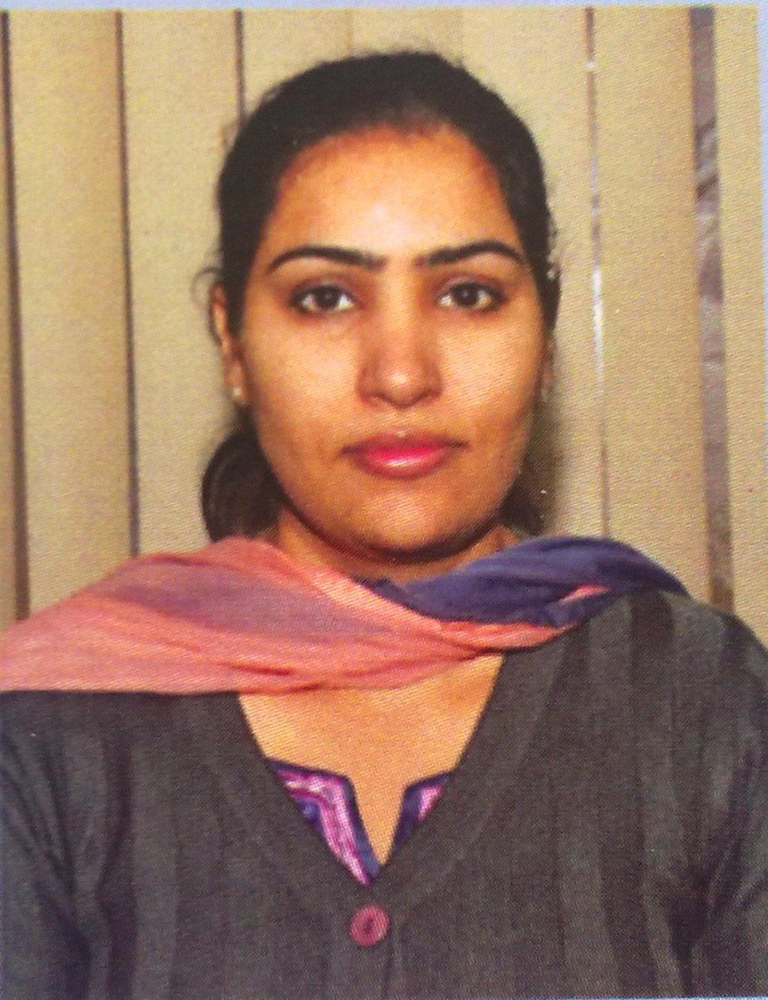

| Photo |  
| ------ | -------- |
| Name | Jasdeep kaur |
| Date of Birth | 22/12/1986 |
| Designation | Assistant Professor |
| Department | Computer Science & Engineering |
| Email | jasdeepkaur_cse@gndec.ac.in |
| Experience | Assistant Professor @ GNDEC, Ludhiana (From September 2013 to till date) |
| Qualification | M.tech (Computer Science & Engineering) , B.tech (Computer Science & Engineering)  |
| No. of Publications (Journal) | 03 |

### *INTRODUCTION*  
 Globalisation of the world economy and higher education are driving profound changes in engineering education system. There is a continuing need to dynamically adapt to these changes, to ensure that we remain competitive and can respond effectively to the challenges of globalisation. Future engineering graduates not only need to be knowledgeable in his/her discipline but also needs a new set of soft, professional skills and competencies. In recent years, there have been essential changes in engineering education in terms of what to teach (content) and how to teach (knowledge delivery) and how to assess (student learning). AICTE has already taken initiation to come out with model curriculum for engineering programs. The digital initiatives of MHRD and AICTE have made available very large number of MOOC courses through SWAYAM, that can help the colleges and teachers to adopt innovative methodologies in the delivery of course. The present report focusses on the recommendations for reforms in examinations (assessment of student) in the context of emerging landscape of engineering education. Examinations/student assessments play a very important role in deciding the quality of education. They must not only assess student’s achievements (and grades) but also measure whether the desired learning outcomes have been achieved. The achievement of objectives and program outcomes are crucial and needs to be proven through accurate and reliable assessments. The academic quality of examinations (question papers) in Indian engineering education system has been a matter of concern from a long time. It is widely acknowledged that “assessment drives learning’’, what and how students learn depends to a major extent on how they think they will be assessed. The question papers that require simple memory recall will not ensure deep, meaningful learning. High expectations for learning motivate the students to rise to the occasion. The assessment (examination) must embed those high expectations to ensure that the learner is motivated to attain them. Considering the above imperatives, it is clear that reforms in Examinations are critical for improvement of the quality of Indian engineering education.
The most important drivers for reforms in examination system of Indian engineering education are:
1.Adaptation of Outcome-Based Education Framework 
1.Importance of Higher-order Abilities and Professional Skills 

## ASSESSMENT STRATEGY FOR OUTCOME-BASED EDUCATION
2.Mapping Program Outcomes to Assessment (Examinations)
2.Two-step Process for Bringing Clarity to POs
2.Program Outcomes – Competencies – Performance Indicators

## IMPROVING STRUCTURE AND QUALITY OF ASSESSMENTS
For improving the structure and quality of assessment in various engineering programs following points need to be remembered: 
1. In Indian engineering education system, written examinations play a major role in assessing the learning and awarding of grades to the student. Universities and colleges give highest weightage to the outcomes of the written examinations in overall grading. Questions raised in the examination/test papers play an important role in defining the level of learning the student is expected to achieve in the courses and hence in the program. Since assessment drives learning, the design of question papers needs to go beyond the mere test of memory recall. They also need to test higher-order abilities and skills. 
2. Written examinations assess a very limited range of outcomes and cognitive levels. Particularly in the courses, where course outcomes (COs) cover a broad range of expectations, written examinations alone will not be sufficient to make valid judgements about student learning. A wide range of assessment methods (e.g., term papers, open-ended problem-solving assignments, course/lab project rubrics, portfolios etc.) need to be employed to ensure that assessment methods match with learning outcomes.
3. It is advisable to formulate assessment plans for each of the course in the program that brings clarity to the following: 
	a. Alignment of assessment with learning outcome of the course 
	b. Level of learning (cognitive) student is expected to achieve 
	c. Assessment method to be adapted 

#Bloom’s Taxonomy for Assessment Design
 

#Action Verbs for Assessment

| Level| Skill Demonstrated | Question cues / Verbs for tests
| ------ | -------- |
| 1. Remember| • Ability to recall of information like facts, conventions, definitions, jargon, technical terms, classifications, categories, and criteria • ability to recall methodology and procedures, abstractions, principles, and theories in the field • knowledge of dates, events, places • mastery of subject matter|list, define, tell, describe, recite, recall, identify, show, label, tabulate, quote, name, who, when, where
| 2. Understand| understanding information • grasp meaning • translate knowledge into new context • interpret facts, compare, contrast • order, group, infer causes • predict consequences|describe, explain, paraphrase, restate, associate, contrast, summarize, differentiate interpret, discuss
| 3. Apply | use information • use methods, concepts, laws, theories in new situations • solve problems using required skills or knowledge • Demonstrating correct usage of a method or procedure |calculate, predict, apply, solve, illustrate, use, demonstrate, determine, model, experiment, show, examine, modify
| 4. Analyse | break down a complex problem into parts • Identify the relationships and interaction between the different parts of a complex problem • identify the missing information, sometimes the redundant information and the contradictory information, if any |classify, outline, break down, categorize, analyze, diagram, illustrate, infer, select
| 5. Evaluate | compare and discriminate between ideas • assess value of theories, presentations • make choices based on reasoned argument • verify value of evidence • recognize subjectivity • use of definite criteria for judgments |assess, decide, choose, rank, grade, test, measure, defend, recommend, convince, select, judge, support, conclude, argue, justify, compare, summarize, evaluate
| 6. Create | use old ideas to create new ones • Combine parts to make (new) whole, • generalize from given facts • relate knowledge from several areas • predict, draw conclusions |design, formulate, build, invent, create, compose, generate, derive, modify, develop, integrate

 

##ASSESSING HIGHER-ORDER ABILITIES & PROFESSIONAL SKILLS
1.	Innovative Educational Experiences to Teach and Assess
2.	Using Scoring Rubrics as Assessment Tool
3.	Open-Book Examinations

#Links to complete policy and model question papers
https://www.aicte-india.org/sites/default/files/ExaminationReforms.pdf
https://www.aicte-india.org/sites/default/files/MQP.pdf